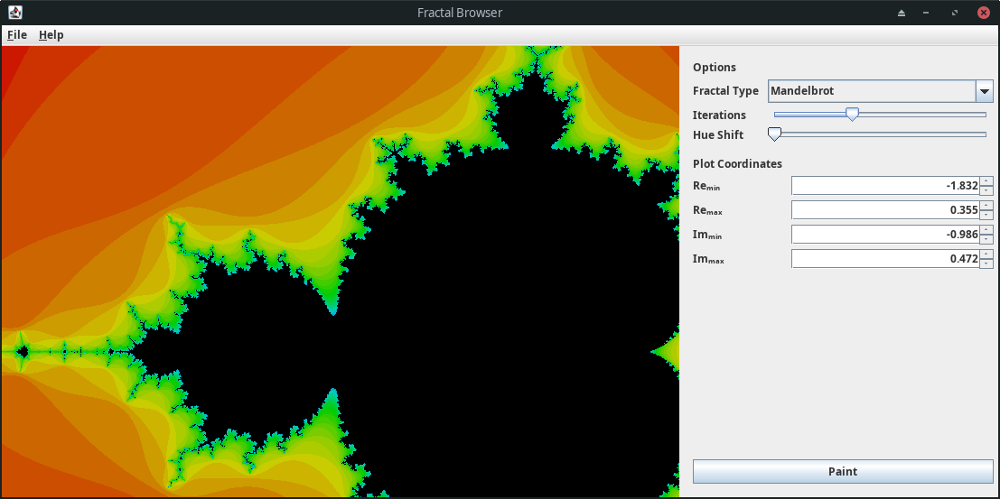
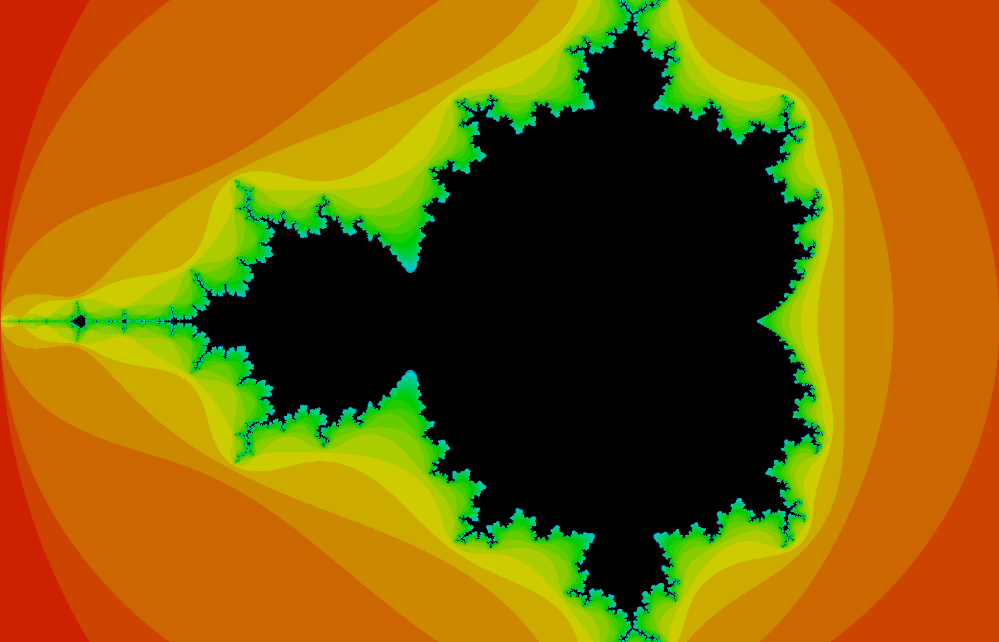
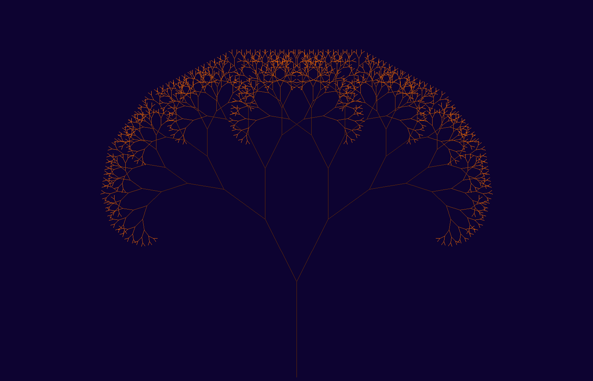
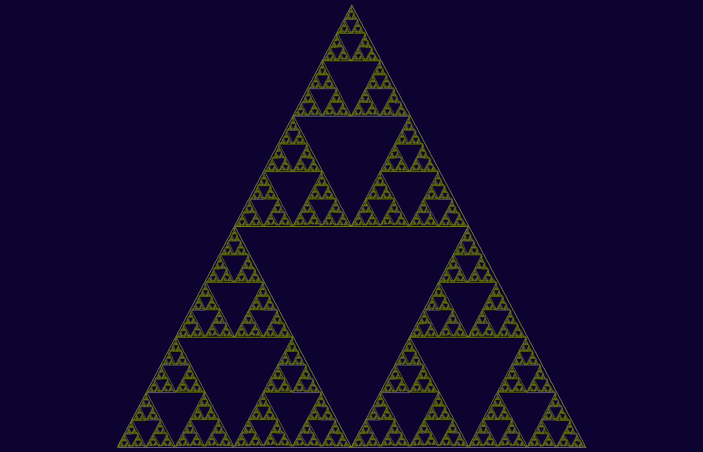

# FractalBrowser

This project features a minimalistic Java GUI application for rendering images of different fractals. It is a university project for our Object-Oriented Programming subject. Currently, there are three available fractals, with different settings to tweak:

1. The Mandelbrot Set

   > It is the set of complex numbers for which the function *f(z) = z^2 + c* does not diverge to infinity when iterated from *z = 0*, i.e., for which the equivalent sequence remains bounded in absolute value.
   >

   This is probably one of the most famous examples of computer generated imagery about complex mathematics.
2. Tree Fractal

   This is a version of the Pythagorean tree, which is a plane fractal constructed from squares. In this instance, it is visualized with diverging lines.
3. Sierpiński triangle

   > It is a [fractal](https://en.wikipedia.org/wiki/Fractal_curve "Fractal curve") [attractive fixed set](https://en.wikipedia.org/wiki/Attractive_fixed_set "Attractive fixed set") with the overall shape of an [equilateral triangle](https://en.wikipedia.org/wiki/Equilateral_triangle "Equilateral triangle"), subdivided [recursively](https://en.wikipedia.org/wiki/Recursion "Recursion") into smaller equilateral triangles.
   >

   In this version, it is drawn as a sequence of internal triangles.

Some of the settings you can tweak include:

* [X] Maximum iteration count
* [X] Hue and brightness
* [X] Coordinates (Mandelbrot only)
* [X] Length of parts (Tree fractal only)
* [X] Angle delta (Tree fractal only)
* [X] Length ratio

For the Mandelbrot set, zooming (with the scroll wheel) and panning (by dragging) are also implemented. It is recommended that you browse around in a smaller window with a low iteration count for tolerable rendering performance.

When you find a configuration that you like, you can switch to full-screen mode (to get a better resolution view) and use the File >> Export Image menu to save it as a PNG.

## Screenshots

## Releases

You can find the latest release on the Releases page.

## Known Issues

* The Mandelbrot renderer sometimes draws blue lines (this is most likely due to a bug with the rational transformations and repainting)
* Panning and zooming can be very slow
* Partial repaints don't work (fixed through an ugly hack that triggers the whole panel to repaint)
* Spinners don't show precise values

## Further Development

To improve this project, it would be possible to abstract the rendering process and implement a multithreaded approach. This would significantly speed up the process by subdividing the actual job and letting different cores handle it. The interactions between the GUI and the actual renderer could be rewritten in a clean and more efficient way (perhaps following the MVC pattern). The repainting issue should be solved by passing a different set of bounds to the renderer, rather than triggering the whole panel's invalidation.

The menus and the available options should be improved to make it less confusing and more user-friendly (for example, adding filters and state for the file chooser of the save dialog).

More fractals can always be added.

## License

This project is licensed under the MIT License. See the [LICENSE]() file for details. For the dependencies, all rights belong to their respective owners. These should be used according to their respective licenses.
